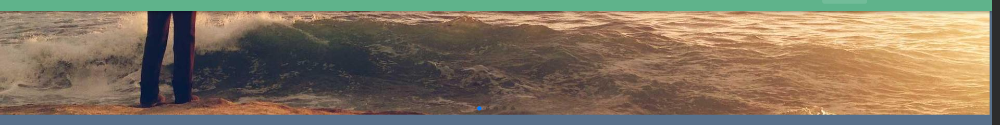
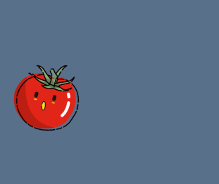
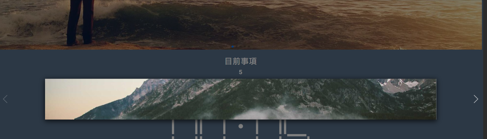

1. 宇翔老師番茄鐘模板
2. 說明使用哪個 Vue 的 UI 套件實作 The Last Template
   - Vuetify
3. 使用 Swiper.js 實作輪播圖
   版面上方
   
4. 使用 GSAP 實作動畫
   版面下方的番茄滾動
   
5. 自選一個套件，專題可能會用到的套件來研究，請找 Vue3 版本，以下是範例：

   - 燈箱展示，lightbox
     輪播圖上
     

6. 說明 3、4、5 使用在哪個區塊，並附上截圖說明
7. 響應式設計，能在手機、平板、電腦上正常顯示
8. 模板參考用，不用完全一致，可以將某些區塊內容用於以上套件實作
